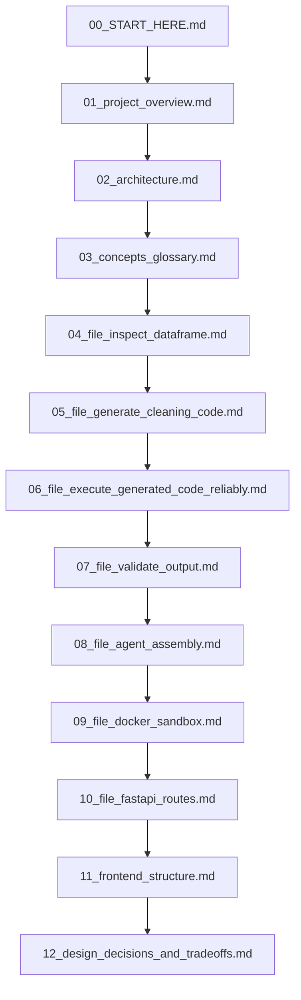

# Documentation Index: Start Here

Welcome to the documentation for the Autonomous Data Cleansing & Feature Engineering Engine. This guide is written for engineers who are familiar with basic Python and data analysis (like `pandas`), but are new to LLM frameworks (like LangChain), containerization (Docker), and multi-step agent architectures.

Use this documentation to understand the project deep enough to confidently explain its architecture, code, and design decisions in a technical interview.

---

## Recommended Reading Order

To get the most out of this documentation, we recommend reading the files in the following order. Reading the **Concepts Glossary** first is highly recommended, as it defines terms used throughout the file-by-file walkthroughs.

---

## Document Summaries

### Part 1: High-Level Overview
*   **[01_project_overview.md](file:///c:/Projects/Autonomous%20Data%20Cleansing%20Engine/docs/01_project_overview.md)**  
    What the application does, the real-world problem it solves, and an resume-ready elevator pitch.
*   **[02_architecture.md](file:///c:/Projects/Autonomous%20Data%20Cleansing%20Engine/docs/02_architecture.md)**  
    The system architecture diagram and a step-by-step request lifecycle walkthrough showing how components interact.
*   **[03_concepts_glossary.md](file:///c:/Projects/Autonomous%20Data%20Cleansing%20Engine/docs/03_concepts_glossary.md)**  
    A friendly primer on the core concepts of LangChain, Docker Sandboxing, and Agent workflows, complete with examples from this project.

### Part 2: Step-by-Step Code Walkthroughs (Backend tools.py)
*   **[04_file_inspect_dataframe.md](file:///c:/Projects/Autonomous%20Data%20Cleansing%20Engine/docs/04_file_inspect_dataframe.md)**  
    How we analyze the uploaded CSV schema and summarize it for the LLM without exceeding context window limits.
*   **[05_file_generate_cleaning_code.md](file:///c:/Projects/Autonomous%20Data%20Cleansing%20Engine/docs/05_file_generate_cleaning_code.md)**  
    How we prompt the model to generate executable Python code and handle edge cases like conversational instructions.
*   **[06_file_execute_generated_code_reliably.md](file:///c:/Projects/Autonomous%20Data%20Cleansing%20Engine/docs/06_file_execute_generated_code_reliably.md)**  
    The mechanics of running code, capturing output, and our self-correction repair loop when execution errors occur.
*   **[07_file_validate_output.md](file:///c:/Projects/Autonomous%20Data%20Cleansing%20Engine/docs/07_file_validate_output.md)**  
    How we compare input and output datasets to raise warnings for massive row/column loss.

### Part 3: Backend Assembly & Sandboxing
*   **[08_file_agent_assembly.md](file:///c:/Projects/Autonomous%20Data%20Cleansing%20Engine/docs/08_file_agent_assembly.md)**  
    How the agent prompt, LLM client, and tools are wired into an Agent Executor, and how we run the post-processing explanation chain.
*   **[09_file_docker_sandbox.md](file:///c:/Projects/Autonomous%20Data%20Cleansing%20Engine/docs/09_file_docker_sandbox.md)**  
    A deep dive into how we configure Docker containers for complete isolation, including network settings, resource limits, and mounts.
*   **[10_file_fastapi_routes.md](file:///c:/Projects/Autonomous%20Data%20Cleansing%20Engine/docs/10_file_fastapi_routes.md)**  
    How the REST API acts as the orchestration glue—managing file uploads, triggering the agent, and formatting outputs for the frontend.

### Part 4: Frontend & Systems Design
*   **[11_frontend_structure.md](file:///c:/Projects/Autonomous%20Data%20Cleansing%20Engine/docs/11_frontend_structure.md)**  
    An overview of the React component structure, state management, and how the UI communicates with the backend.
*   **[12_design_decisions_and_tradeoffs.md](file:///c:/Projects/Autonomous%20Data%20Cleansing%20Engine/docs/12_design_decisions_and_tradeoffs.md)**  
    An interview-ready compilation of major architectural decisions: why sandboxing, why deterministic retries, why a separate validation layer, and more.
