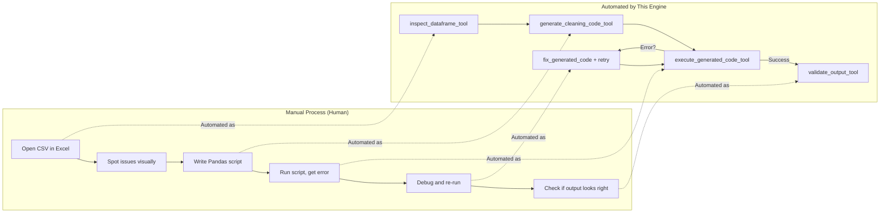

# Project Overview

The Autonomous Data Cleansing & Feature Engineering Engine is a web application that cleans and transforms CSV files using natural language instructions. Users upload a raw data file and describe in plain language the changes they want to make. The application automatically generates Python code to clean the dataset, executes it in a secure sandbox, validates the results, and displays the cleaned output for download.

---

## The Problem It Solves

Data cleaning is one of the most time-consuming and repetitive parts of data science and analysis. Data scientists and business analysts often spend hours writing boilerplate code to:
*   Standardize date formats.
*   Impute or fill missing values.
*   Filter out invalid data rows.
*   Correct spelling mistakes.
*   Remove duplicate entries.

Because every dataset has a different structure and different anomalies, this process is difficult to automate with static scripts. Typically, a human must manually inspect the file, write custom Pandas scripts, handle runtime errors, and verify the output. This manual loop is repetitive and inefficient. This project solves that problem by building an autonomous system that mimics this inspection, code writing, execution, validation, and correction loop.

### How the System Mirrors the Manual Process

---

## Resume-Ready Elevator Pitch

Developed an AI-driven, autonomous data engineering pipeline that cleans and transforms tabular datasets from natural-language instructions. Built using a React frontend and a FastAPI backend, the system orchestrates a LangChain agent that generates custom Pandas transformation code using Groq's LLaMA 3.3 model. To ensure safety and system reliability, generated scripts are executed inside resource-constrained, network-isolated Docker containers with an automated Python-based self-correction loop that fixes syntax or runtime errors. The engine performs post-execution row and column validation, summarizes changes in plain English, and provides side-by-side interactive data previews.
