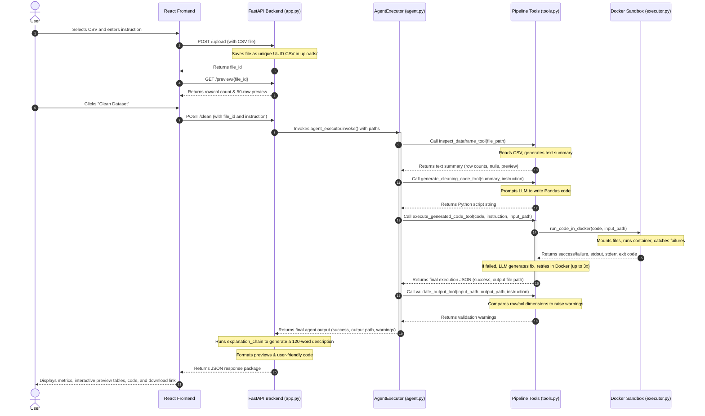

# System Architecture

This document explains the architecture of the Autonomous Data Cleansing & Feature Engineering Engine. It includes a high-level diagram, a detailed walkthrough of how a request moves through the system, and an explanation of why the components are separated.

---

## High-Level Architecture Diagram

The system is split into a frontend UI, a backend API, an autonomous LLM agent layer, and an isolated execution environment:

```
[ React Frontend ]
       │  ▲
       │  │ (HTTP requests: /upload, /preview, /clean, /download)
       ▼  │
[ FastAPI Backend (app.py) ]
       │  ▲
       │  │ (Invokes LangChain AgentExecutor)
       ▼  │
[ LangChain AgentExecutor (agent.py) ] ─── (Uses: ChatGroq LLaMA-3.3)
       │
       ├─► [ inspect_dataframe_tool ] ─────────► (Reads input CSV schema on host)
       ├─► [ generate_cleaning_code_tool ] ────► (Generates Python script via LLM)
       ├─► [ execute_generated_code_tool ] ────► [ Docker Sandbox (executor.py) ]
       │                                                    │
       │                                                    ▼
       │                                         [ Isolated Container ]
       │                                         (Runs Pandas code safely,
       │                                          self-corrects errors)
       ▼
[ validate_output_tool ] ───────────────────────► (Validates row/column integrity)
```

---

## Vocabulary for Beginners

Before diving into the lifecycle, here are the core terms defined in plain language:
*   **FastAPI**: A modern Python framework used to build Web APIs (interfaces that let a web browser frontend communicate with backend server code over HTTP requests).
*   **LangChain**: A software toolkit that makes it easier to build applications powered by Large Language Models (LLMs), helping connect prompts, models, and external tools.
*   **Tool**: In LangChain, a "tool" is a Python function that the LLM agent can choose to call when it needs to perform an action (like reading a file or running a container).
*   **AgentExecutor**: The runtime engine in LangChain that coordinates the loop of: prompting the LLM, catching the tool it wants to call, running that tool, passing the tool output back to the LLM, and repeating until a final answer is reached.
*   **Docker Sandbox**: An isolated virtual container environment where we can run untrusted Python code. It is locked down so it cannot access the network, access host files (except those explicitly shared), or consume too much memory.

---

## Detailed Request Lifecycle

Here is exactly what happens, step-by-step, when a user uploads a file and clicks the **"Clean Dataset"** button:



### 1. File Upload and Initial Preview
*   **File Upload**: The user selects a CSV file. The frontend calls the API endpoint `POST /upload` defined in [app.py](file:///c:/Projects/Autonomous%20Data%20Cleansing%20Engine/backend/api/app.py#L53). The backend saves it to `/tmp/cleansing-data/uploads/` using a unique ID (UUID) and returns that `file_id`.
*   **Data Preview**: The frontend calls `GET /preview/{file_id}`. The backend uses Pandas to parse the first 50 rows of the raw CSV, converting missing values to empty strings, and sends it back to display in the "Before" table.

### 2. Initiating the Cleaning Run
*   When the user submits an instruction, the React frontend issues a `POST /clean` request containing the `file_id` and the user's `instruction`.
*   FastAPI's `clean_csv` handler parses this request and invokes `agent_executor.invoke` with the formatted input string containing the absolute file path and the instruction.

### 3. Agent Tool Pipeline (Under the Hood)
*   **Step 1: Inspecting the Data**  
    The agent calls `inspect_dataframe_tool(file_path)` inside [tools.py](file:///c:/Projects/Autonomous%20Data%20Cleansing%20Engine/backend/agent/tools.py#L437). This reads the CSV and returns a schema summary (columns, types, missing values count) as a text block.
*   **Step 2: Generating Code**  
    The agent passes the summary and the user's instruction to `generate_cleaning_code_tool` in [tools.py](file:///c:/Projects/Autonomous%20Data%20Cleansing%20Engine/backend/agent/tools.py#L458). This sends a prompt to the ChatGroq model requesting a Python script. The tool returns the raw Python code.
*   **Step 3: Running and Fixing the Code**  
    The agent passes the script, instruction, and input file path to `execute_generated_code_tool` in [tools.py](file:///c:/Projects/Autonomous%20Data%20Cleansing%20Engine/backend/agent/tools.py#L485). 
    - This launches the Docker sandbox via `run_code_in_docker` in [executor.py](file:///c:/Projects/Autonomous%20Data%20Cleansing%20Engine/backend/sandbox/executor.py#L22).
    - If the container execution fails, `execute_with_self_correction` catches the error logs (`stderr`), sends them to the LLM to get fixed code, and retries inside Docker. This runs up to 3 times.
*   **Step 4: Validating Output**  
    Once code execution succeeds, the agent calls `validate_output_tool` in [tools.py](file:///c:/Projects/Autonomous%20Data%20Cleansing%20Engine/backend/agent/tools.py#L527). This inspects the output CSV relative to the input CSV to detect anomalous changes (like accidentally dropping all rows).

### 4. Post-Processing and UI Rendering
*   The agent returns the results to FastAPI.
*   FastAPI runs a separate, simple LLM chain (`explanation_chain`) to write a plain-English explanation under 120 words.
*   FastAPI loads the cleaned output CSV, reads a 50-row preview, replaces absolute container paths in the code string (like `/sandbox/input.csv`) with user-friendly file names, and returns a JSON payload to the frontend.
*   The frontend switches to the `done` view, showing the side-by-side tables, metrics, generated code, and providing a download button which calls `GET /download`.

---

## Separation of Concerns

The system separates HTTP requests, LLM reasoning, and code execution. This boundary exists for three main reasons:

1.  **Security Boundaries**: The FastAPI application runs on the host system or in a standard web container with network and filesystem access. LLM-generated code, however, is unpredictable. We *never* execute generated code in the same environment as the API. Instead, we isolate it in a network-less, memory-capped Docker container.
2.  **API Resilience**: Running an LLM agent takes time (often 5 to 15 seconds). By isolating the agent logic within LangChain, the FastAPI routes can remain simple entry points. If the agent crashes, the FastAPI server remains running and can return a standard `500 Internal Server Error` without crashing the application.
3.  **Prompt Token Economy**: The LLM does not need to see the millions of data rows in the CSV file to write cleaning code. Instead, a local Python script extracts a lightweight text schema (summary) and sends only that summary to the LLM. This saves time, reduces API costs, and avoids exceeding the LLM's context token limits.
