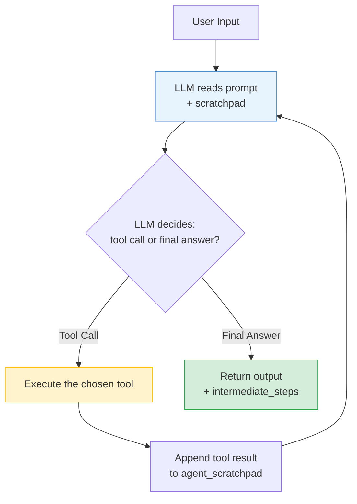

# Concepts Glossary

This glossary defines the core concepts and technologies used in this project. Each concept includes a simple explanation and a concrete example taken directly from the codebase.

---

## 1. LangChain Tool (`@tool`)

### Plain-Language Definition
A **Tool** is a Python function that we give to an LLM agent so it can interact with the outside world. An LLM on its own can only output text. By wrapping a python function with LangChain's `@tool` decorator, we turn that function into a tool that the agent can choose to execute when it needs to retrieve information or perform an action.

### Project Example
We define four tools in [tools.py](file:///c:/Projects/Autonomous%20Data%20Cleansing%20Engine/backend/agent/tools.py). For instance, the `inspect_dataframe_tool` is wrapped with the `@tool` decorator. It accepts a `file_path` and returns a string summary:

```python
@tool
def inspect_dataframe_tool(file_path: str) -> str:
    """
    Inspect a CSV file and return a structured summary of its schema.
    ...
    """
    result = inspect_dataframe(file_path)
    return result.summary
```

When we load the agent, we pass it this list of tools. The agent reads the docstring of the tool to understand when and how to use it.

---

## 2. LCEL (LangChain Expression Language)

### Plain-Language Definition
**LCEL (LangChain Expression Language)** is a syntax provided by LangChain to chain different components together using the pipe operator (`|`). A typical chain takes a user input, formats it into a template (**Prompt**), sends the formatted text to the AI model (**LLM**), and cleans up the model's text response (**Output Parser**). 

The pipe operator automatically handles passing the output of one step as the input to the next: `chain = prompt | llm | parser`.

### Project Example
In [tools.py](file:///c:/Projects/Autonomous%20Data%20Cleansing%20Engine/backend/agent/tools.py#L132-L140), we use LCEL to build the code generator:

```python
# LCEL Chain
chain = prompt | llm | parser

generated_code = chain.invoke(
    {
        "schema_summary": schema_summary,
        "user_instruction": user_instruction,
    }
)
```

---

## 3. ChatPromptTemplate

### Plain-Language Definition
A **ChatPromptTemplate** is a structured template used to format messages before they are sent to a chat-based LLM. It helps separate the instructions given to the model (the **System** role) from the messages sent by the user (the **Human** role) or placeholders for conversation history.

### Project Example
In [tools.py](file:///c:/Projects/Autonomous%20Data%20Cleansing%20Engine/backend/agent/tools.py#L88-L128), we define the prompt for generating code:

```python
prompt = ChatPromptTemplate.from_messages(
    [
        (
            "system",
            """
            You are an expert Python data engineer.
            Write ONLY executable Python code.
            ...
            """,
        ),
        (
            "human",
            """
            Dataset Summary:
            {schema_summary}
            User Instruction:
            {user_instruction}
            """,
        ),
    ]
)
```

---

## 4. AgentExecutor and create_tool_calling_agent

### Plain-Language Definition
*   **create_tool_calling_agent**: A LangChain function that takes an LLM, a list of tools, and a structured prompt, and packages them into an "Agent" object. This agent is capable of selecting tool calls based on user input.
*   **AgentExecutor**: The runtime engine that actually executes the agent. It runs in a loop: it feeds inputs to the agent, calls the tools the agent selected, injects the tool results back into the agent's history, and repeats this until the agent decides to return a final response.

### Project Example
In [agent.py](file:///c:/Projects/Autonomous%20Data%20Cleansing%20Engine/backend/agent/agent.py#L104-L119), we wire up the agent and executor:

```python
agent = create_tool_calling_agent(
    llm=llm,
    tools=tools,
    prompt=prompt,
)

agent_executor = AgentExecutor(
    agent=agent,
    tools=tools,
    verbose=True,
    return_intermediate_steps=True,
)
```

### How the AgentExecutor Loop Works



---

## 5. agent_scratchpad

### Plain-Language Definition
The **agent_scratchpad** is a temporary workspace variable in the agent's prompt template. It acts as a placeholder where LangChain automatically inserts the history of actions the agent has taken and the results returned by tools during a single request. Without this scratchpad, the agent would forget what tools it has already run and what their outputs were, leading to infinite loops.

### Project Example
In [agent.py](file:///c:/Projects/Autonomous%20Data%20Cleansing%20Engine/backend/agent/agent.py#L96), we place `MessagesPlaceholder(variable_name="agent_scratchpad")` at the end of the prompt template:

```python
prompt = ChatPromptTemplate.from_messages(
    [
        ("system", "You are an autonomous data cleansing agent..."),
        ("human", "{input}"),
        MessagesPlaceholder(variable_name="agent_scratchpad"),
    ]
)
```

---

## 6. Docker Container Isolation

### Plain-Language Definition
**Docker container isolation** is the practice of running an application in a secure sandbox that is walled off from the host operating system. We restrict it so that if the generated code is malicious or faulty, it cannot harm the main server:
*   `network_mode="none"`: Completely disables internet access within the container, preventing the code from uploading files or connecting to malicious servers.
*   `mem_limit="256m"`: Restricts memory usage to 256 Megabytes. If a script runs a runaway loop that allocates memory, it crashes inside the container instead of locking up the main server.

### Project Example
In [executor.py](file:///c:/Projects/Autonomous%20Data%20Cleansing%20Engine/backend/sandbox/executor.py#L91-L101), we launch the container with these strict isolation parameters:

```python
container = client.containers.run(
    image=SANDBOX_IMAGE,
    command="python /sandbox/generated_script.py",
    detach=True,
    network_mode="none",
    mem_limit="256m",
    nano_cpus=1_000_000_000, # Limit to exactly 1 CPU core
    working_dir="/sandbox",
    read_only=True,          # Root filesystem is read-only
    volumes=volumes,
)
```

---

## 7. Self-Correction / Retry Loop

### Plain-Language Definition
A **Self-Correction Loop** is a design pattern where the system automatically attempts to repair errors. Instead of immediately returning an error response to the user when code fails to execute, the system catches the error log (`stderr`), feeds it back to the LLM alongside the original script, and asks the LLM to write a fixed version.

### Project Example
In [tools.py](file:///c:/Projects/Autonomous%20Data%20Cleansing%20Engine/backend/agent/tools.py#L365-L412), we manage the correction loop inside `execute_with_self_correction`:

```python
for attempt in range(1, max_attempts + 1):
    result = _execute_generated_code_once(code=code, input_csv_path=input_csv_path)
    if result["success"]:
        return ExecutionResult(...) # Success, return output
    
    # Otherwise, ask the LLM to fix the code using stderr
    fix_result = fix_generated_code(
        original_code=code,
        user_instruction=user_instruction,
        stderr=result["stderr"],
    )
    code = fix_result
```
