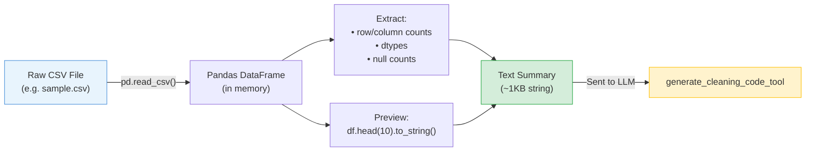

# File Walkthrough: DataFrame Inspection

This document walks through the dataset inspection logic found in the `inspect_dataframe` function in [tools.py](file:///c:/Projects/Autonomous%20Data%20Cleansing%20Engine/backend/agent/tools.py).

---

## Responsibility
The `inspect_dataframe` function is responsible for reading the raw CSV file on the host machine and generating a structured text summary that describes its columns, data types, missing values, and rows.

### Data Flow



---

## Vocabulary for Beginners
*   **Pandas DataFrame**: A two-dimensional, tabular data structure in Python (similar to a SQL table or a sheet in an Excel workbook) that makes it easy to manipulate data.
*   **dtype**: Short for data type, this represents the computer's internal format for values in a column, such as `int64` (integers), `float64` (decimal numbers), or `object` (usually text/strings).
*   **Missing Values / Nulls**: Empty cells in a spreadsheet or dataset where no data is recorded.
*   **Context Window**: The maximum amount of text (tokens) that an LLM can read and process at a single time.

---

## Code Breakdown and Explanation

Here is the implementation of `inspect_dataframe` from [tools.py](file:///c:/Projects/Autonomous%20Data%20Cleansing%20Engine/backend/agent/tools.py#L20-L75):

### Part 1: Loading the CSV and Counting Rows/Columns
```python
def inspect_dataframe(file_path: str) -> InspectResult:
    # Read the CSV file into a Pandas DataFrame
    df = pd.read_csv(file_path)

    # Get the row and column counts
    total_rows = len(df)
    total_columns = len(df.columns)
    column_names = list(df.columns)
```
*   **What it does**: It reads the CSV file from the host's uploads directory and stores it as a Pandas DataFrame. It then extracts the row count, column count, and a list of column names.
*   **Why**: The LLM needs to know the basic dimensions of the dataset to write accurate cleaning code. For example, if a dataset has 1,000 rows and the cleaning script outputs 0 rows, the engine knows something went wrong.

### Part 2: Extracting Data Types and Missing Values
```python
    # Map each column to its data type string
    column_dtypes = {
        column: str(dtype)
        for column, dtype in df.dtypes.items()
    }

    # Count empty values in each column
    missing_values = {
        column: int(count)
        for column, count in df.isnull().sum().items()
    }
```
*   **What it does**: It creates two Python dictionaries. One maps column names to their data types (`column_dtypes`), and the other maps column names to the count of empty cells (`missing_values`).
*   **Why**: The LLM must understand the current structure to clean it. For example, if a column named `Age` is stored as a string (`object`) instead of a decimal (`float64`), the LLM will generate code to convert the types. Similarly, seeing columns with high missing value counts tells the LLM where it needs to fill or impute missing data.

### Part 3: Creating a Row Preview and Formatted Summary
```python
    # Capture a string preview of the first 10 rows
    preview = df.head(10).to_string()

    # Build the structured text summary
    summary_lines = [
      f"Total Rows: {total_rows}",
      f"Total Columns: {total_columns}",
      "",
      "Columns and Data Types:",
    ]

    for column, dtype in column_dtypes.items():
        summary_lines.append(f"- {column}: {dtype}")

    summary_lines.append("")
    summary_lines.append("Missing Values:")

    for column, count in missing_values.items():
        summary_lines.append(f"- {column}: {count}")

    summary_lines.append("")
    summary_lines.append("First 10 Rows:")
    summary_lines.append(preview)

    summary = "\n".join(summary_lines)
```
*   **What it does**: It extracts the first 10 rows as a formatted string and constructs a single long text summary.
*   **Why**: This formats the structural information into a clean, human-readable text block. The LLM can easily parse this text format to write its python script.

### Part 4: Returning a Structured Schema Object
```python
    return InspectResult(
        total_rows=total_rows,
        total_columns=total_columns,
        column_names=column_names,
        column_dtypes=column_dtypes,
        missing_values=missing_values,
        preview=preview,
        summary=summary,
    )
```
*   **What it does**: It returns a Pydantic schema model containing the raw counts, preview, and the formatted summary string.
*   **Why**: Returning a structured Pydantic object allows the caller (like FastAPI or the LangChain tools) to access individual attributes easily, while the agent executor uses `result.summary` to inform the LLM.

---

## Key Design Decision: Summary vs. Full CSV

A critical design choice is **why we return a text summary rather than sending the raw CSV to the LLM**. 

1.  **Token Limits**: CSV files can contain hundreds of thousands of rows. LLMs have a strict limit on the number of words (tokens) they can read. Sending a large raw CSV would crash the LLM or exceed its context window.
2.  **Cost and Speed**: Sending megabytes of raw text to an external LLM API (like Groq) is slow and expensive. A text summary is extremely lightweight (typically under 1KB) but contains all the structural clues the LLM needs to write accurate Pandas code.
3.  **Code Generation vs. Manual Cleaning**: The LLM's role is not to clean the data itself. Its role is to *write a Python program* that cleans the data. To write a program, the LLM only needs to know the "rules of the table" (the columns, data types, and formatting patterns in the first few rows). The actual execution of the code on the entire dataset is performed locally by Python.
