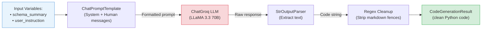

# File Walkthrough: Generating Cleaning Code

This document walks through the code generation logic found in the `generate_cleaning_code` function in [tools.py](file:///c:/Projects/Autonomous%20Data%20Cleansing%20Engine/backend/agent/tools.py).

---

## Responsibility
The `generate_cleaning_code` function is responsible for using the LLM to write a self-contained Python script using Pandas that reads an input CSV file and transforms it based on the user's instructions.

### LCEL Chain Flow



---

## Vocabulary for Beginners
*   **StrOutputParser**: A LangChain component that parses the LLM's raw response object and extracts only the text string, stripping away metadata.
*   **LCEL Chain**: Short for LangChain Expression Language Chain. A set of LangChain components linked together with the pipe (`|`) operator.
*   **Markdown Code Fences**: The triple backticks (e.g., ` ```python ` and ` ``` `) that programmers use to format code blocks in chat messages and markdown files.
*   **Regex Sub**: Short for Regular Expression Substitution (using Python's `re.sub`). It is a utility used to find text matching a specific pattern and replace it with something else.

---

## Code Breakdown and Explanation

Here is the implementation of `generate_cleaning_code` from [tools.py](file:///c:/Projects/Autonomous%20Data%20Cleansing%20Engine/backend/agent/tools.py#L79-L159):

### Part 1: Defining the System Guidelines
```python
    prompt = ChatPromptTemplate.from_messages(
        [
            (
                "system",
                """
                You are an expert Python data engineer.

                Write ONLY executable Python code.

                Rules:
                1. Read the dataset from '/sandbox/input.csv'
                2. Save the cleaned dataset to '/sandbox/output/output.csv'
                3. Perform ONLY the transformation requested by the user. If the user's instruction is conversational, a greeting (e.g., "hi", "hello", "hey"), or does not ask for any changes/modifications to the dataset, write a Python script that simply reads the dataset and saves it to the output path without making ANY changes or transformations to the data.
                4. Import ONLY:
                - pandas
                - numpy
                - re
                5. Do NOT print explanations.
                6. Do NOT use markdown.
                7. Do NOT wrap the code inside ```python or ``` fences.
                8. The final script must be directly executable.
                9. SAFETY: The output dataset must NEVER have 0 rows. If your transformations would remove all rows, skip that transformation and keep the data as-is.
                10. When removing duplicates, use df.drop_duplicates() on ALL columns. Do NOT drop identifier columns before checking for duplicates.
                11. When filling missing values (e.g., fillna with median), apply it ONLY to the specific column the user mentions. Do NOT drop rows with missing values unless the user explicitly asks to drop them.
                12. Always use inplace=False and reassign (e.g., df = df.drop_duplicates()) rather than inplace=True.
                """,
            ),
```
*   **What it does**: It sets up strict boundaries for the LLM. It defines exactly where the input CSV is (`/sandbox/input.csv`), where to write the output (`/sandbox/output/output.csv`), and limits the allowed packages to `pandas`, `numpy`, and `re`. It also establishes safety rules (e.g., do not empty the dataset, use `inplace=False`).
*   **Why**:
    *   **Paths**: The container expects files at exact locations. The LLM must use these exact paths, or the code will crash during execution because the input file won't be found.
    *   **Libraries**: Limiting imports to `pandas`, `numpy`, and `re` is a security and stability choice. The Docker sandbox does not have access to the internet to download extra packages, and restricting packages prevents malicious or heavy libraries from executing.
    *   **Inplace Warning**: Pandas sometimes triggers warning messages when using `inplace=True` on filtered subsets (known as a `SettingWithCopyWarning`). Instructing the model to use reassignment (e.g., `df = df.drop()`) prevents these warnings from cluttering execution logs.

### Part 2: Handling Non-Actionable or Conversational Inputs
*   **Look at Rule 3**: *"...If the user's instruction is conversational... write a Python script that simply reads the dataset and saves it..."*
*   **Why**: If a user types *"hello"* or *"hey there"*, the LLM might get confused or try to output conversational English rather than valid Python code. This rule ensures the LLM still generates valid Python code that reads the input and saves it to the output unchanged. This prevents the execution container from crashing when no cleaning is requested.

### Part 3: Running the LCEL Chain
```python
            (
                "human",
                """
                Dataset Summary:

                {schema_summary}

                User Instruction:

                {user_instruction}
                """,
            ),
        ]
    )

    parser = StrOutputParser()

    # LCEL Chain
    chain = prompt | llm | parser

    generated_code = chain.invoke(
        {
            "schema_summary": schema_summary,
            "user_instruction": user_instruction,
        }
    )
```
*   **What it does**: It combines the prompt template, the ChatGroq model, and a string parser into a single executable pipeline (`chain`). It passes the inspection summary and the user's cleaning description, then runs the model.

### Part 4: Removing Markdown Fences (Regex Cleaning)
```python
    # Remove markdown fences if the model adds them anyway
    generated_code = re.sub(
        r"^```(?:python)?\s*",
        "",
        generated_code.strip(),
        flags=re.IGNORECASE,
    )

    generated_code = re.sub(
        r"\s*```$",
        "",
        generated_code,
    )

    return CodeGenerationResult(
        generated_code=generated_code
    )
```
*   **What it does**: Although we tell the LLM *not* to use markdown code blocks, LLMs are heavily trained to wrap code in triple backticks (e.g., ` ```python ... ``` `). If the LLM generates backticks, this regex substitution code finds and deletes them.
*   **Why**: If we write the raw response containing ` ```python ` directly to a `.py` script, the Python compiler inside the Docker container will crash with a `SyntaxError`. The regex ensures we only write clean, executable Python lines.
