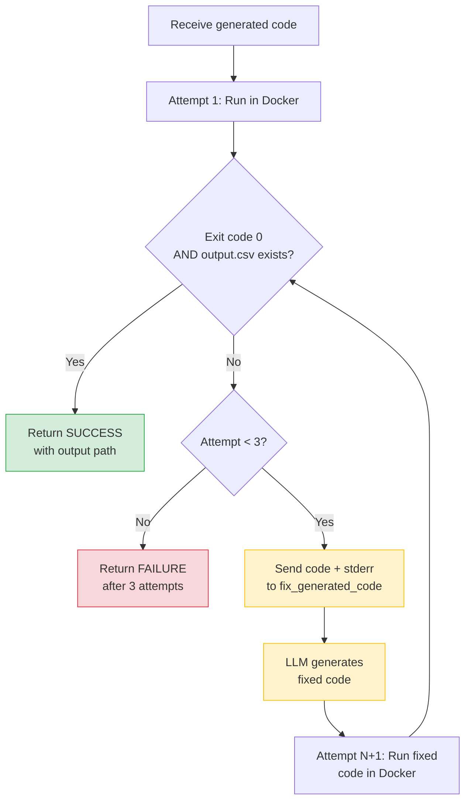

# File Walkthrough: Code Execution & Self-Correction

This document walks through how we execute LLM-generated code and repair it when it errors. These functions are located in [tools.py](file:///c:/Projects/Autonomous%20Data%20Cleansing%20Engine/backend/agent/tools.py).

---

## Responsibility
The execution functions are responsible for running the generated Python script in the Docker container, catching any errors, and using the LLM to rewrite and fix the code if it crashes.

### Self-Correction Flowchart



---

## Vocabulary for Beginners
*   **stderr**: Short for Standard Error, this is the destination where a running program writes its error logs and crash tracebacks.
*   **exit code**: A status number returned by a program when it finishes. An exit code of `0` means success, while anything else (like `1` or `-1`) indicates an error.
*   **Wrapper Function**: A simple function whose primary purpose is to call another function, often adapting the inputs or outputs to fit a specific framework.
*   **Self-Correction**: The automated process where the system sends a program's error message back to the AI model so it can fix its own mistake.

---

## Code Breakdown and Explanation

Let's walk through the three main functions that handle execution:

### 1. The Core Sandbox Trigger: `_execute_generated_code_once`
```python
def _execute_generated_code_once(
    code: str,
    input_csv_path: str,
    ) -> dict:
    return run_code_in_docker(
        code=code,
        input_csv_path=input_csv_path,
    )
```
*   **What it does**: It accepts the code string and input path, and forwards them directly to the Docker executor.
*   **Why**: It provides a clean, single-execution gateway that hides the details of Docker from the retry loop.

---

### 2. The Orchestration Loop: `execute_with_self_correction`
This is where the retry logic lives:

```python
def execute_with_self_correction(
    generated_code: str,
    user_instruction: str,
    input_csv_path: str,
    max_attempts: int = 3,
    ) -> ExecutionResult:

    code = generated_code
    last_result = None

    for attempt in range(1, max_attempts + 1):
        print(f"\n========== Attempt {attempt} ==========\n")

        # 1. Run the code in the Docker sandbox
        result = _execute_generated_code_once(
            code=code,
            input_csv_path=input_csv_path,
        )

        # 2. If it succeeds, return the result immediately
        if result["success"]:
            return ExecutionResult(
                success=True,
                generated_code=code,
                output_path=result["output_path"],
                stdout=result["stdout"],
                stderr=result["stderr"],
                exit_code=result["exit_code"],
                execution_time=result["execution_time"],
                attempts=attempt,
                message="Execution completed successfully.",
            )

        last_result = result

        # 3. If we've run out of attempts, stop
        if attempt == max_attempts:
            break

        # 4. Otherwise, use the error output to fix the code
        fix_result = fix_generated_code(
            original_code=code,
            user_instruction=user_instruction,
            stderr=result["stderr"],
        )

        code = fix_result
```
*   **What it does**: It loops up to 3 times. On each iteration, it runs the code in the sandbox. If the code succeeds, the function returns immediately. If the code fails, it takes the error traceback (`stderr`) and the original code, calls `fix_generated_code` (which prompts the LLM to write corrected code), updates the code variable, and loops again.
*   **Why**: LLMs frequently make minor syntax mistakes or reference columns incorrectly on their first attempt (e.g., trying to convert a date string using a format that doesn't match). Catching the error and feeding it back to the LLM allows it to correct its own mistake without requiring human intervention.

---

### 3. The LLM Repair Function: `fix_generated_code`
```python
def fix_generated_code(
    original_code: str,
    user_instruction: str,
    stderr: str,
    ) -> str:
    prompt = ChatPromptTemplate.from_messages(
        [
            (
                "system",
                """
                You are an expert Python data engineer.
                The previous Python script failed.
                Your task is to FIX it.
                Rules: ...
                """,
            ),
            (
                "human",
                """
                User Instruction: {instruction}
                Previous Code: {code}
                Execution Error: {stderr}
                """,
            ),
        ]
    )
    # Uses StrOutputParser and regex cleaning to extract corrected code...
```
*   **What it does**: It builds a prompt specifically explaining to the LLM that its last script failed. It feeds the LLM the original instruction, the broken code, and the error traceback.
*   **Why**: Giving the model the exact error message is the most reliable way to help it resolve bugs. Most code errors (like referencing a column that doesn't exist) are trivial for the LLM to fix once it sees the traceback.

---

### 4. The Tool Wrapper: `execute_generated_code_reliably`
```python
def execute_generated_code_reliably(
    generated_code: str,
    user_instruction: str,
    input_csv_path: str,
    ) -> ExecutionResult:
    return execute_with_self_correction(
        generated_code=generated_code,
        user_instruction=user_instruction,
        input_csv_path=input_csv_path,
    )
```
*   **What it does**: This function acts as a wrapper that calls `execute_with_self_correction` with the default 3 attempts.

---

## Key Design Decisions

### Why is `execute_with_self_correction` separate from the `@tool` wrapper?
In the codebase, `execute_generated_code_tool` is the LangChain Tool wrapper:

```python
@tool
def execute_generated_code_tool(...) -> str:
    result = execute_generated_code_reliably(...)
    # formats results to JSON string
```
We separate the core execution code (`execute_with_self_correction`) from the LangChain tool interface for two reasons:
1.  **Separation of Concerns**: Core Python logic (running loops, managing file paths) should be clean and readable, without LangChain decorators and JSON formatting cluttering it.
2.  **Testability**: It allows developers to import and test the self-correction loop in standard Python test scripts (e.g., `test_retry.py`) without having to initialize LangChain agent objects.

### Why are retries capped at 3?
*   **Diminishing Returns**: If the LLM cannot fix the code in 3 attempts, it is highly likely that the error is due to a fundamental misunderstanding of the request, or a major discrepancy in the dataset. Allowing more retries would waste API tokens and increase response time without a high chance of success.
*   **Latency**: Each LLM call takes 1 to 3 seconds. Capping attempts at 3 ensures that if a script is completely unfixable, the user receives an error response in a reasonable time (under 10-15 seconds) rather than waiting indefinitely.
