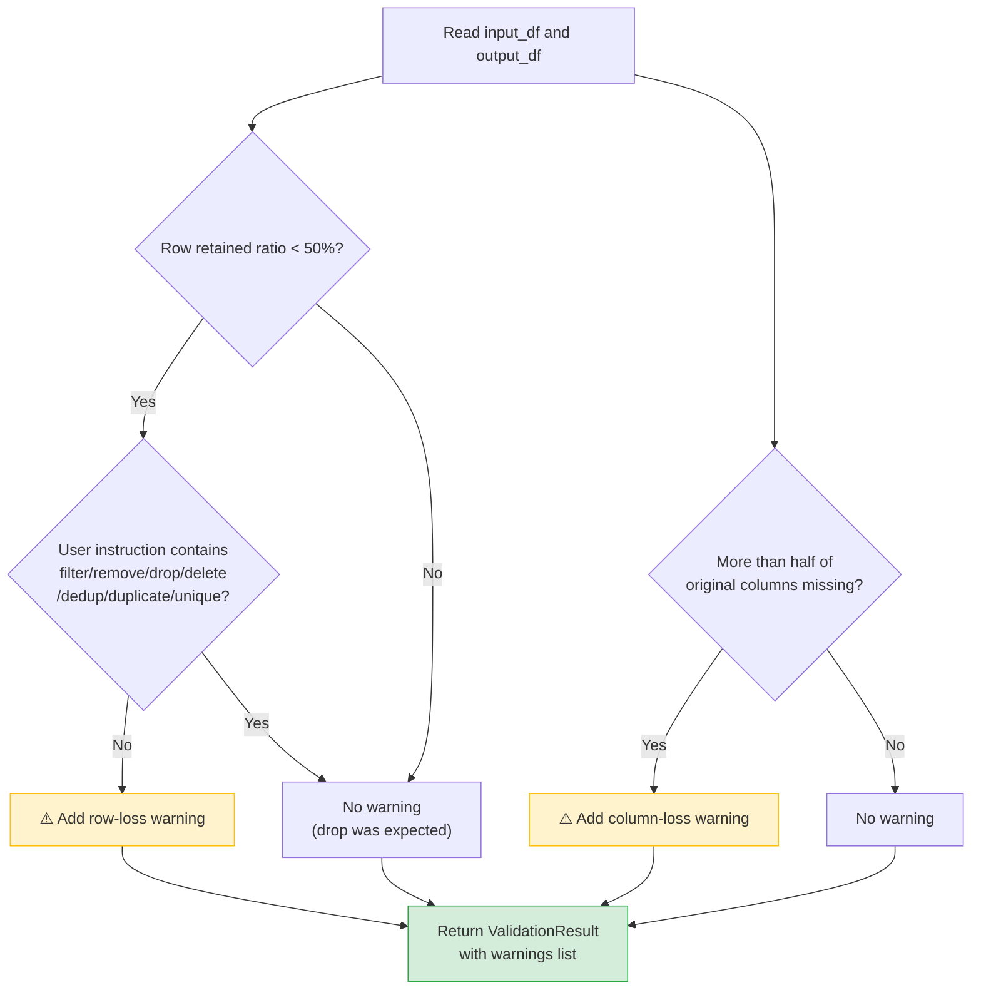

# File Walkthrough: Output Validation

This document walks through the post-execution validation logic in the `validate_output` function in [tools.py](file:///c:/Projects/Autonomous%20Data%20Cleansing%20Engine/backend/agent/tools.py).

---

## Responsibility
The `validate_output` function is responsible for comparing the cleaned CSV output against the original input CSV to detect anomalous changes (like massive column or row deletion) and report them to the user as validation warnings.

### Validation Decision Tree



---

## Vocabulary for Beginners
*   **Validation Warning**: An alert raised by the system when the data looks suspicious, even if the code ran successfully without crashing.
*   **Retained Ratio**: The proportion of rows preserved in the output dataset relative to the original dataset. For example, if the input file has 100 rows and the output has 40, the retained ratio is `0.40`.

---

## Code Breakdown and Explanation

Here is the implementation of `validate_output` from [tools.py](file:///c:/Projects/Autonomous%20Data%20Cleansing%20Engine/backend/agent/tools.py#L280-L347):

### Part 1: Initializing and Reading Datasets
```python
def validate_output(
    input_csv_path: str,
    output_csv_path: str,
    user_instruction: str,
    ) -> ValidationResult:

    warnings = []

    # Read both datasets into memory
    input_df = pd.read_csv(input_csv_path)
    output_df = pd.read_csv(output_csv_path)
```
*   **What it does**: It instantiates an empty list to collect warnings, and reads both the original uploaded CSV and the newly cleaned output CSV into Pandas DataFrames on the host system.

### Part 2: Checking for Massive Row Loss
```python
    # -------------------------------------------------
    # Row Count Validation
    # -------------------------------------------------
    original_rows = len(input_df)
    cleaned_rows = len(output_df)

    if original_rows > 0:
        # Calculate what fraction of rows were kept
        retained_ratio = cleaned_rows / original_rows

        instruction = user_instruction.lower()

        # Check if the user asked to remove rows
        expected_large_drop = any(
            keyword in instruction
            for keyword in [
                "filter",
                "remove",
                "drop",
                "delete",
                "dedup",
                "duplicate",
                "unique",
            ]
        )

        # Flag if drop was severe and unexpected
        if retained_ratio < 0.5 and not expected_large_drop:
            warnings.append(
                f"Row count decreased from {original_rows} "
                f"to {cleaned_rows} "
                "(more than 50%). Verify this was intentional."
            )
```
*   **What it does**: It checks if more than 50% of the rows were deleted. It looks at the user's cleaning instruction for keywords (like "filter" or "drop"). If a massive row drop occurred and no row-dropping keywords were in the prompt, it appends a warning to the list.
*   **Why**: An LLM-generated script might contain a logical error. For example, if a script filters on `df[df['Country'] == 'USA']` but the country column actually contains `'United States'`, the filter will match zero rows. The script executes without an error (exit code 0), but the data is wiped out. This check catches that logical bug.

### Part 3: Checking for Massive Column Loss
```python
    # -------------------------------------------------
    # Column Validation
    # -------------------------------------------------
    original_columns = set(input_df.columns)
    output_columns = set(output_df.columns)

    # Find columns that are in the input but missing from the output
    missing_columns = sorted(original_columns - output_columns)

    # Flag if more than half of the columns are missing
    if len(missing_columns) > len(original_columns) / 2:
        warnings.append(
            f"More than half of the original columns are missing. "
            f"Missing columns: {missing_columns}"
        )

    return ValidationResult(
        warnings=warnings
    )
```
*   **What it does**: It uses Python `set` operations to find columns that were deleted. If more than 50% of the columns are missing from the output, it records a warning listing those columns.
*   **Why**: If the LLM generates a script that accidentally overrides the dataframe, or misunderstands a request to drop a single column and drops most columns instead, this warning alerts the user.

---

## Key Design Decision: Why a Separate Validation Layer?

In many AI systems, if a script runs with exit code `0` (meaning it didn't crash), the system assumes success. In this project, we built a **dedicated validation layer** that runs *after* successful execution.

1.  **Logical Success != Syntactic Success**: A computer program can be syntactically perfect (no spelling errors, runs to completion) but logically incorrect. If an LLM-generated script deletes all rows because of a minor typo, Python runs it successfully. Without validation, the user would receive an empty CSV file and the system would report "Success".
2.  **Safety Buffer**: It acts as a safety guardrail. Instead of trying to force the LLM to inspect its own work inside Docker (which is slow and resource-heavy), we run deterministic Python checks on the host. 
3.  **Actionable Alerts**: It formats warnings in a structured format and displays them as warnings on the frontend dashboard. The user is alerted to inspect the data preview before downloading.
