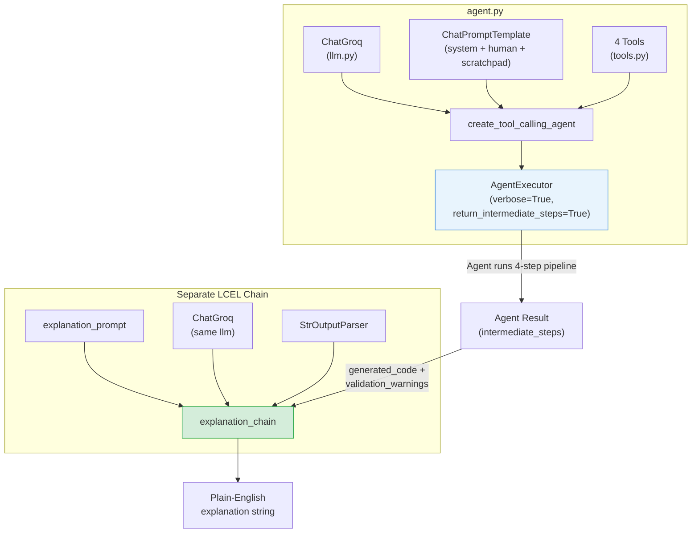

# File Walkthrough: Agent Assembly

This document walks through how the LLM Agent and its tools are wired together in [agent.py](file:///c:/Projects/Autonomous%20Data%20Cleansing%20Engine/backend/agent/agent.py).

---

## Responsibility
The [agent.py](file:///c:/Projects/Autonomous%20Data%20Cleansing%20Engine/backend/agent/agent.py) file is responsible for assembling the tools, prompts, and LLM into a LangChain agent executor, and defining the post-execution explanation chain.

### How Components Wire Together



---

## Vocabulary for Beginners
*   **ChatPromptTemplate**: A class in LangChain that structures prompts by categorizing system directives, human inputs, and conversation logs.
*   **AgentExecutor**: The runtime engine that manages the execution loop of the agent: prompting the model, executing chosen tools, updating the history, and returning the final result.
*   **StrOutputParser**: A component that extracts only the plain text string from the LLM response object.
*   **Chain Link**: A single step in a sequential LangChain pipeline connected using the pipe operator (`|`).

---

## Code Breakdown and Explanation

### Part 1: Loading the Tools and Prompt
```python
tools = [
    inspect_dataframe_tool,
    generate_cleaning_code_tool,
    execute_generated_code_tool,
    validate_output_tool,
]

prompt = ChatPromptTemplate.from_messages(
    [
        (
            "system",
            """
            You are an autonomous data cleansing agent.
            You have access to four tools.
            You MUST follow this workflow exactly.

            Step 1: Call inspect_dataframe_tool using the CSV file path.
            Step 2: Pass ONLY that summary to generate_cleaning_code_tool.
            Step 3: Pass ONLY that generated code to execute_generated_code_tool.
            Step 4: If execution succeeds, call validate_output_tool.

            Finally return: success, output CSV path, validation warnings.
            ...
            """,
        ),
        ("human", "{input}"),
        MessagesPlaceholder(variable_name="agent_scratchpad"),
    ]
)
```
*   **What it does**: It lists the four tools built in [tools.py](file:///c:/Projects/Autonomous%20Data%20Cleansing%20Engine/backend/agent/tools.py) and structures a prompt. The system instructions explicitly direct the LLM to follow a linear 4-step pipeline: inspect -> generate -> execute -> validate. It uses a placeholder for the `agent_scratchpad`.
*   **Why**:
    *   **Workflow Constraints**: By forcing the agent to execute tools in this exact order, we prevent it from trying to write code before inspecting, or trying to execute code without checking parameters first.
    *   **Scratchpad**: The `agent_scratchpad` is critical because it records intermediate steps. As the agent runs each tool, the results are saved here. Without it, the agent would lose track of what it did in previous steps.

### Part 2: Creating the Agent and Executor
```python
agent = create_tool_calling_agent(
    llm=llm,
    tools=tools,
    prompt=prompt,
)

agent_executor = AgentExecutor(
    agent=agent,
    tools=tools,
    verbose=True,
    return_intermediate_steps=True,
)
```
*   **What it does**: It binds the LLM client, the list of tools, and the workflow prompt into a tool-calling agent. It then creates the `AgentExecutor`.
*   **Why**: Setting `return_intermediate_steps=True` is vital. It tells the executor to save the exact outputs of every tool execution. The FastAPI backend reads these intermediate logs to extract the generated Python code and the output path.

### Part 3: Assembling the Explanation Chain
```python
explanation_prompt = ChatPromptTemplate.from_messages(
    [
        (
            "system",
            """
            You are a data engineering assistant.
            Write ONE short paragraph explaining, in plain English, what was done to the dataset.
            Do not mention Docker, LangChain or implementation details.
            Keep it under 120 words.
            """,
        ),
        (
            "human",
            """
            User Instruction: {instruction}
            Generated Python Code: {generated_code}
            Validation Warnings: {validation_warnings}
            """,
        ),
    ]
)

explanation_chain = (
    explanation_prompt
    | llm
    | StrOutputParser()
)
```
*   **What it does**: It constructs a standard chain using prompt templates and pipes. This chain takes the user's instructions, the final generated code, and validation warnings, and formats them into a plain-English explanation under 120 words, filtering out any backend jargon.

---

## Key Design Decision: Why is the Explanation Chain separate?

You might wonder why we build a separate `explanation_chain` instead of making the agent output the explanation as part of the main `agent_executor` loop.

1.  **Lower Latency**: Running the explanation as a separate chain avoids bloating the agent prompt with unnecessary instructions and history. Once the agent is done, we run the explanation chain in a single, fast forward pass.
2.  **Strict Formatting**: Agents are unpredictable because they control their own tool loop. By using a simple, dedicated LCEL chain (`explanation_prompt | llm | StrOutputParser()`), we guarantee that the output is formatted strictly as a single string paragraph, without any risk of the agent choosing to call tools or outputting formatting headers.
3.  **Clean Separation of Roles**: The agent's role is execution and validation (actions). The explanation chain's role is summarization (reporting). Separating these duties keeps both systems simple.
