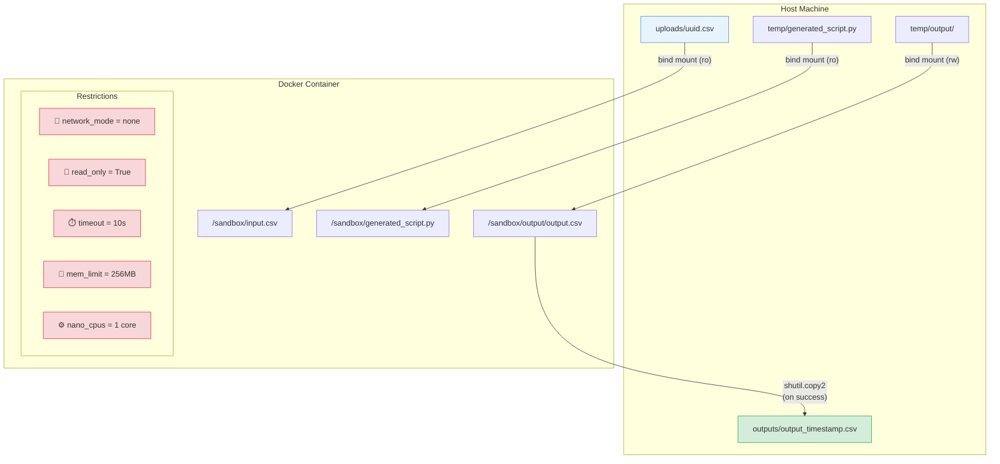

# File Walkthrough: Docker Sandbox Executor

This document details the Docker sandbox environment configured in [executor.py](file:///c:/Projects/Autonomous%20Data%20Cleansing%20Engine/backend/sandbox/executor.py) and [Dockerfile.sandbox](file:///c:/Projects/Autonomous%20Data%20Cleansing%20Engine/docker/Dockerfile.sandbox).

---

## Responsibility
The Docker executor is responsible for taking a Python code string, running it inside a secure, resource-constrained, and isolated Docker container, capturing its terminal output, and returning the resulting output CSV path.

### Container Isolation & Volume Mount Diagram



---

## Vocabulary for Beginners
*   **Docker Image**: A read-only template that package up an operating system, runtime libraries, and environment settings required to run an application.
*   **Docker SDK**: A Python package that lets a Python script interact with the local Docker daemon to build, run, configure, and delete containers programmatically.
*   **Docker Volume Mount**: A shared bridge that maps a file or folder on the host computer to a folder inside the running Docker container.
*   **Read-Only Mode (`ro`)**: A security configuration that allows a container to read files from the host but forbids it from making modifications or deleting them.

---

## Code Breakdown and Explanation

### 1. Dockerfile Sandbox Configuration
Before looking at the Python controller, let's look at the sandbox configuration in [Dockerfile.sandbox](file:///c:/Projects/Autonomous%20Data%20Cleansing%20Engine/docker/Dockerfile.sandbox):

```dockerfile
FROM python:3.11-slim
ENV PYTHONDONTWRITEBYTECODE=1
ENV PYTHONUNBUFFERED=1
WORKDIR /sandbox
RUN pip install --no-cache-dir pandas numpy
```
*   **What it does**: It starts from a minimal Python image (`3.11-slim`), sets environment variables to disable writing `.pyc` files and force immediate terminal log printing, creates a `/sandbox` directory, and installs *only* `pandas` and `numpy`.
*   **Why**: By leaving out extra libraries and avoiding default commands, this image remains lightweight and exposes a minimal footprint. If the generated script attempts to import an unauthorized library, the run will fail immediately.

---

### 2. Python Executor: `run_code_in_docker`
Now let's examine the Python execution code in [executor.py](file:///c:/Projects/Autonomous%20Data%20Cleansing%20Engine/backend/sandbox/executor.py#L22):

#### Step A: Creating Temporary Folders
```python
def run_code_in_docker(code: str, input_csv_path: str) -> dict:
    client = docker.from_env()

    # Create a temporary directory on the host
    temp_dir = tempfile.mkdtemp(dir=SANDBOX_WORK_DIR)
    container = None

    try:
        script_path = os.path.join(temp_dir, "generated_script.py")
        output_dir = os.path.join(temp_dir, "output")
        os.makedirs(output_dir, exist_ok=True)

        # Write the LLM code to a python file
        with open(script_path, "w", encoding="utf-8") as f:
            f.write(code)
```
*   **What it does**: It connects to the Docker runtime using the Docker SDK. It creates a temporary workspace folder on the host under `/tmp/cleansing-data/sandbox/` and writes the generated python code string into `generated_script.py`. It also creates an empty `output` folder.

#### Step B: Configuring Volume Mounts
```python
        volumes = {
            os.path.abspath(input_csv_path): {
                "bind": "/sandbox/input.csv",
                "mode": "ro", # Read-Only
            },
            os.path.abspath(script_path): {
                "bind": "/sandbox/generated_script.py",
                "mode": "ro", # Read-Only
            },
            os.path.abspath(output_dir): {
                "bind": "/sandbox/output",
                "mode": "rw", # Read-Write
            },
        }
```
*   **What it does**: It sets up directory mapping:
    *   The host's raw CSV file is mounted to `/sandbox/input.csv` as **Read-Only** (`ro`).
    *   The temporary script is mounted to `/sandbox/generated_script.py` as **Read-Only** (`ro`).
    *   The temporary output folder is mounted to `/sandbox/output` as **Read-Write** (`rw`).
*   **Why**: The container must never be allowed to overwrite or delete the input CSV file. By mapping the input file as read-only, the host data remains untouched. The only place the container is allowed to write data is inside `/sandbox/output`, which maps to the temporary host directory.

#### Step C: Running the Container with Strict Resource Limits
```python
        start_time = time.perf_counter()

        container = client.containers.run(
            image=SANDBOX_IMAGE,
            command="python /sandbox/generated_script.py",
            detach=True,
            network_mode="none",
            mem_limit="256m",
            nano_cpus=1_000_000_000,
            working_dir="/sandbox",
            read_only=True,
            volumes=volumes,
        )
```
*   **What it does**: It fires up the container and runs the script. Let's analyze each sandbox parameter:
    *   `network_mode="none"`: Disables the container's network interface card. The code cannot download dependencies or make web requests.
    *   `mem_limit="256m"`: Limits the container to 256MB of RAM.
    *   `nano_cpus=1_000_000_000`: Restricts execution to exactly 1 CPU core.
    *   `read_only=True`: Forces the container's root operating system filesystem to be read-only. The script cannot modify system configuration files.

#### Step D: Managing Timeouts and Capturing Logs
```python
        try:
            # Wait up to 10 seconds for the script to finish
            result = container.wait(timeout=10)
            exit_code = result["StatusCode"]

        except Exception:
            # If it runs longer than 10 seconds, kill it
            container.kill()
            exit_code = -1

        execution_time = round(time.perf_counter() - start_time, 3)

        # Retrieve terminal logs
        stdout = container.logs(stdout=True, stderr=False).decode("utf-8")
        stderr = container.logs(stdout=False, stderr=True).decode("utf-8")
```
*   **What it does**: It waits for the container to complete. If the script is still running after 10 seconds, it throws an exception, and the executor kills the container. It then captures the terminal standard output (`stdout`) and standard error logs (`stderr`).
*   **Why**: If the LLM generates a script containing an infinite loop (e.g. `while True:`), a standard Python interpreter would run forever. The 10-second timeout ensures that runaway scripts are terminated.

#### Step E: Copying the Output and Cleanup
```python
        generated_output = os.path.join(output_dir, "output.csv")
        success = (exit_code == 0 and os.path.exists(generated_output))
        final_output_path = None

        if success:
            timestamp = int(time.time())
            final_output_path = OUTPUT_DIR / f"output_{timestamp}.csv"
            # Copy output file out of temporary directory
            shutil.copy2(generated_output, final_output_path)

        return {
            "success": success,
            "output_path": str(final_output_path) if success else None,
            "stdout": stdout,
            "stderr": stderr,
            "exit_code": exit_code,
            "execution_time": execution_time,
        }
```
*   **What it does**: If the script completed with exit code `0` and wrote the output CSV, it copies the output out of the temporary folder into `/tmp/cleansing-data/outputs/` with a timestamp name, and returns success.

```python
    finally:
        # Always remove container
        if container is not None:
            try:
                container.remove(force=True)
            except Exception:
                pass

        # Always remove temporary workspace
        shutil.rmtree(temp_dir, ignore_errors=True)
```
*   **What it does**: The `finally` block is guaranteed to run. It forces the Docker container to be destroyed (`container.remove(force=True)`) and deletes the temporary host directory (`shutil.rmtree`).
*   **Why**: Running many executions would fill up the host's disk space with stopped container instances and old script folders. Immediate cleanup keeps the host system clean and stable.
