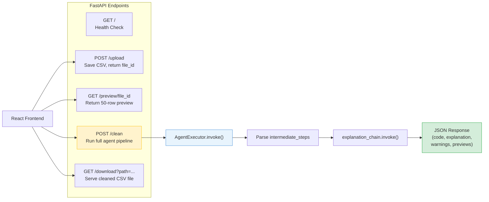

# File Walkthrough: FastAPI Web Routes

This document walks through the API endpoints and routing logic defined in [app.py](file:///c:/Projects/Autonomous%20Data%20Cleansing%20Engine/backend/api/app.py).

---

## Responsibility
The [app.py](file:///c:/Projects/Autonomous%20Data%20Cleansing%20Engine/backend/api/app.py) file is responsible for exposing HTTP web routes, handling CSV file uploads and downloads, invoking the LangChain agent, and formatting the response data for the React frontend.

### Endpoint Map



---

## Vocabulary for Beginners
*   **HTTP Endpoint**: A specific web address (URL) exposed by a server that client applications (like web browsers) can call to fetch data or trigger actions.
*   **CORS Middleware**: Short for Cross-Origin Resource Sharing. A security configuration that defines which external website domains (like a React app running on a different port) are permitted to connect to the API.
*   **UUID**: Short for Universally Unique Identifier. A randomized 36-character string used to ensure that files uploaded by different users have completely unique names and don't overwrite each other.
*   **Intermediate Steps**: The historical record of all tool calls and their text outputs compiled by LangChain's `AgentExecutor` during a single run.
*   **Path Re-writing**: The process of searching a text string for local directory paths (like `/sandbox/input.csv`) and replacing them with clean filenames (like `input.csv`) to make them user-friendly.

---

## Code Breakdown and Explanation

### Part 1: Server Initialization and CORS Setup
```python
app = FastAPI(
    title="Autonomous Data Cleansing & Feature Engineering Engine",
    version="1.0.0",
)

origins = [
    "http://localhost:5173",                     # Local React Dev Server
    "https://autonomous-data-cleansing-engine.vercel.app", # Vercel URL
]

app.add_middleware(
    CORSMiddleware,
    allow_origins=origins,
    allow_credentials=True,
    allow_methods=["*"],
    allow_headers=["*"],
)
```
*   **What it does**: It starts the FastAPI server instance and configures CORS. It tells the backend that only requests coming from the React dev server (`localhost:5173`) or the deployed Vercel domain are authorized to call these endpoints.

---

### Part 2: Upload CSV Endpoint (`POST /upload`)
```python
@app.post("/upload")
async def upload_csv(file: UploadFile = File(...)):
    if not file.filename.lower().endswith(".csv"):
        raise HTTPException(
            status_code=400,
            detail="Only CSV files are allowed."
        )

    # Generate a unique ID
    file_id = str(uuid.uuid4())

    file_path = os.path.join(
        UPLOAD_DIR,
        f"{file_id}.csv"
    )

    # Save uploaded file
    with open(file_path, "wb") as buffer:
        shutil.copyfileobj(file.file, buffer)

    return {
        "file_id": file_id
    }
```
*   **What it does**: It validates that the uploaded file has a `.csv` extension. It generates a random UUID (e.g. `6e4db7c8-...`), creates a file path on the host, copies the uploaded file bytes to that path, and returns the unique `file_id` to the frontend.
*   **Why**: Storing files with UUID filenames prevents name collisions (e.g. if two users upload files named `data.csv` at the same time).

---

### Part 3: Preview Data Endpoint (`GET /preview/{file_id}`)
```python
@app.get("/preview/{file_id}")
async def preview_csv(file_id: str):
    file_path = os.path.join(UPLOAD_DIR, f"{file_id}.csv")
    if not os.path.exists(file_path):
        raise HTTPException(status_code=404, detail="File not found.")
    
    df = pd.read_csv(file_path)
    return {
        "total_rows": len(df),
        "total_columns": len(df.columns),
        "columns": list(df.columns),
        "rows": df.head(50).fillna("").to_dict(orient="records"),
    }
```
*   **What it does**: It loads the first 50 rows of the requested CSV on the host using Pandas, replaces empty values (`NaN`) with empty strings `""`, and returns it as a list of dictionaries. It also returns the column list and dimensions.
*   **Why**: Giving the user an immediate preview of their file before they type cleaning instructions helps them verify that the upload succeeded. Reading only 50 rows keeps the preview load extremely fast.

---

### Part 4: The Core Cleansing Endpoint (`POST /clean`)
This is the main orchestration endpoint. Let's break it down in chunks:

#### Chunk A: Triggering the Agent
```python
@app.post("/clean")
async def clean_csv(request: CleanRequest):
    file_path = os.path.join(UPLOAD_DIR, f"{request.file_id}.csv")
    
    # ... checks if file exists ...

    agent_input = (
        f"CSV Path:\n{file_path}\n\n"
        f"User Instruction:\n{request.instruction}"
    )

    try:
        agent_result = agent_executor.invoke(
            {"input": agent_input}
        )
```
*   **What it does**: It formats a instruction message containing the host path to the input CSV and the cleaning prompt. It then calls `agent_executor.invoke()` and waits for the agent to complete the entire pipeline.

#### Chunk B: Parsing the Intermediate steps
```python
    agent_output = agent_result.get("output", "")

    generated_code = ""
    output_path = None
    validation_warnings = []

    # Iterate through the steps recorded by LangChain
    for step in agent_result.get("intermediate_steps", []):
        action, observation = step

        # If this step ran the execution tool, extract the code and output path
        if action.tool == "execute_generated_code_tool":
            try:
                exec_data = json.loads(observation)
                generated_code = exec_data.get("generated_code", "")
                if exec_data.get("success"):
                    output_path = exec_data.get("output_path")
            except (json.JSONDecodeError, TypeError):
                pass

        # If this step ran the validation tool, extract the warnings
        elif action.tool == "validate_output_tool":
            try:
                val_data = json.loads(observation)
                validation_warnings = val_data.get("warnings", [])
            except (json.JSONDecodeError, TypeError):
                pass
```
*   **What it does**: Instead of relying on the final text paragraph returned by the agent, this loop looks through the history (`intermediate_steps`) of the run. It extracts the raw code and host output path from `execute_generated_code_tool` and the warnings list from `validate_output_tool`.
*   **Why**: The LLM agent might not print out the code and paths in a structured JSON structure in its final message. Parsing the tool outputs directly from `intermediate_steps` is the most reliable way to extract structured backend variables.

#### Chunk C: Formatting the Output for display
```python
    # Generate the plain-English explanation
    explanation = ""
    if generated_code:
        try:
            explanation = explanation_chain.invoke({
                "instruction": request.instruction,
                "generated_code": generated_code,
                "validation_warnings": "\n".join(validation_warnings) if validation_warnings else "No warnings."
            })
        except Exception:
            explanation = "Explanation generation failed."

    # Compute preview and row metrics for the frontend
    input_row_count = len(pd.read_csv(file_path))
    output_row_count = len(pd.read_csv(output_path)) if output_path is not None else 0
    output_preview_rows = (
        pd.read_csv(output_path).head(50).fillna("").to_dict(orient="records")
        if output_path is not None
        else []
    )

    # Path Re-writing
    user_friendly_code = generated_code
    if user_friendly_code:
        user_friendly_code = user_friendly_code.replace("/sandbox/input.csv", "input.csv")
        user_friendly_code = user_friendly_code.replace("/sandbox/output/output.csv", "cleaned_output.csv")

    return {
        "success": output_path is not None,
        "output_path": output_path,
        "generated_code": user_friendly_code,
        "explanation": explanation,
        "validation_warnings": validation_warnings,
        "input_row_count": input_row_count,
        "output_row_count": output_row_count,
        "output_preview_rows": output_preview_rows,
    }
```
*   **What it does**: 
    1.  It runs the `explanation_chain` to create a plain-English explanation of the changes.
    2.  It reads the cleaned output CSV file to get the final row count and a 50-row preview.
    3.  **Path Re-writing**: It cleans up the code string. It replaces `/sandbox/input.csv` with `input.csv` and `/sandbox/output/output.csv` with `cleaned_output.csv`.
    4.  It packs these variables and sends them back to the frontend.
*   **Why**: Users don't need to see internal container path mappings like `/sandbox/input.csv` in the code viewer. Path re-writing ensures that the code displayed on the UI looks like a clean script that the user could run locally on their own computer.
