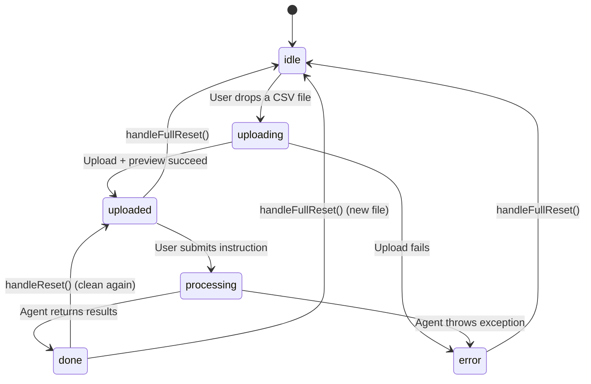

# Frontend Structure

This document explains the organization and state flow of the React frontend application located in the `frontend/` directory.

---

## Vocabulary for Beginners
*   **State Variable**: A special React variable that holds dynamic data representing the current state of the application. When a state variable is updated, React automatically re-renders the UI to display the new information.
*   **Effect Hook (`useEffect`)**: A React feature that allows developers to trigger side effects (like running timers, fetching data, or subscribing to events) in response to state transitions.
*   **API Client**: A collection of Javascript helper functions that execute HTTP fetch requests to send and receive data from backend server endpoints.

---

## Component Layout & Structure

The user interface is designed as a single-page dashboard. The core logic resides in [App.jsx](file:///c:/Projects/Autonomous%20Data%20Cleansing%20Engine/frontend/src/App.jsx), which coordinates the display of several smaller UI components located under `frontend/src/components/`:

```
[ App.jsx ]  <-- Tracks state, coordinates uploads & requests
    │
    ├── [ Header ]             <-- Displays title and app description
    ├── [ UploadZone ]         <-- File dropzone (triggers file upload)
    ├── [ InstructionInput ]   <-- Input text box (submits instruction)
    ├── [ ProgressStepper ]    <-- Visual progress indicators (Inspecting -> Validating)
    │
    └── (Results Grid - displayed only when status is 'done')
         ├── [ SummaryMetrics ] <-- Card grids for row metrics and warning counts
         ├── [ DataPreview ]    <-- Side-by-side interactive preview tables
         ├── [ Explanation ]    <-- Renders plain-English LLM explanation
         ├── [ Warnings ]       <-- Lists validation warning messages
         ├── [ CodeViewer ]     <-- Renders generated Python Pandas code
         └── [ ActionBar ]      <-- Holds Download and Reset buttons
```

---

## State Management

The application state is managed centrally within the `App` component in [App.jsx](file:///c:/Projects/Autonomous%20Data%20Cleansing%20Engine/frontend/src/App.jsx#L19-L30). Here are the primary state variables:

| State Variable | Type | Description |
| :--- | :--- | :--- |
| `status` | `string` | Tracks application stage: `'idle'`, `'uploading'`, `'uploaded'`, `'processing'`, `'done'`, or `'error'`. |
| `fileId` | `string` | Stores the unique UUID file identifier returned by the backend. |
| `fileName` | `string` | Holds the name of the uploaded CSV file (e.g. `sample.csv`). |
| `fileStats` | `object` | Stores row count and column count of the uploaded file. |
| `previewBefore` | `array` | Holds the first 50 rows of the raw CSV file to render in the "Before" table. |
| `previewColumns` | `array` | A list of column header names used to render the table headers. |
| `currentStep` | `number` | Tracks the active visual stage of the Progress Stepper (0 to 3). |
| `result` | `object` | Stores the final JSON package returned by the `/clean` endpoint. |
| `errorMessage` | `string` | Stores details of any network or execution errors. |

### State Machine Diagram

The `status` variable drives the entire UI. Here is how it transitions:



---

## UI Stepper Animation

Because the LLM agent takes several seconds to run, the frontend uses a simulated stepper timer to keep the user engaged and show what the backend is working on:

```javascript
// Stepper simulation timer
useEffect(() => {
  let timer;
  if (status === 'processing') {
    // Simulate stepper progress every 2.5 seconds
    timer = setInterval(() => {
      setCurrentStep((prev) => (prev < 2 ? prev + 1 : prev));
    }, 2500);
  } else {
    setCurrentStep(0);
  }
  return () => clearInterval(timer);
}, [status]);
```
*   **How it works**:
    1.  When the user submits an instruction, `status` changes to `'processing'`, starting the stepper at step `0` (**Inspecting**).
    2.  An interval triggers every 2.5 seconds, incrementing the step to `1` (**Generating Code**) and then `2` (**Executing**).
    3.  Once the API request finishes, the frontend forces the step to `3` (**Validating**) for a brief 600ms window before transitioning `status` to `'done'` and showing the dashboard. This ensures the user gets a smooth visual experience.

---

## API Client Integration

The frontend calls the backend routes via helper functions in [client.js](file:///c:/Projects/Autonomous%20Data%20Cleansing%20Engine/frontend/src/api/client.js). 

### 1. Upload Flow
When a file is dropped into `UploadZone`, the frontend triggers `handleUpload` which calls:
*   `uploadCSV(file)`: Sends a `POST /upload` request containing the raw file. It retrieves the unique `file_id`.
*   `previewCSV(fileId)`: Sends a `GET /preview/{fileId}` request. It retrieves the row/column metrics and the first 50 records.
*   Once both succeed, the app stores this data and changes `status` to `'uploaded'`, exposing the prompt input box.

### 2. Clean Flow
When a user clicks "Clean Dataset", the frontend triggers `handleClean` which calls:
*   `cleanCSV(fileId, instruction)`: Sends a `POST /clean` request containing the file ID and user instructions.
*   When the API responds with success, the app stores the result object and changes `status` to `'done'`.

### 3. Download Flow
When the user clicks "Download Cleaned CSV" in the `ActionBar`, the button triggers a browser download pointing to:
*   `getDownloadURL(result.output_path)`: Renders as `${API_BASE}/download?path={encoded_output_path}`. The browser downloads the CSV file directly from the host outputs directory.
