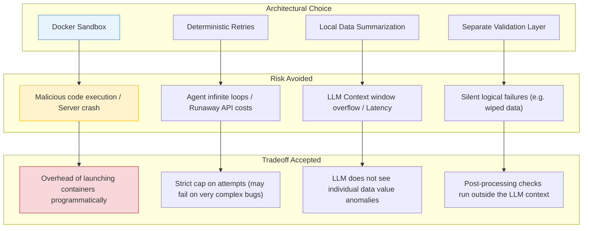

# Design Decisions & Tradeoffs

This document gathers the engineering design decisions and tradeoffs made in this project. Each topic is presented as an interview-ready talking point.

---

## Vocabulary for Beginners
*   **Docker Sandboxing**: The practice of running code inside a secure container to isolate it from the host computer's filesystem, network, and resources.
*   **Deterministic Logic**: Standard programming code (like loops, counters, and conditionals) that follows fixed rules and yields predictable behavior every time it runs.
*   **Thin API Wrapper**: An API layer that handles HTTP routing, file handling, and response formatting, while delegating complex operations (like agent workflows) to separate layers.
*   **SettingWithCopyWarning**: A common warning raised by the Pandas library when a script tries to write values to a filtered copy of a dataset instead of writing directly to the original dataframe.

---

## 1. Why Docker Sandboxing instead of Running LLM Code Directly?

### The Decision
All LLM-generated Python code is executed inside a resource-constrained, network-less Docker container, rather than running it directly on the host server.

### Interview Talking Point
> *"Executing LLM-generated code on a host server is a massive security risk. An LLM might generate code that attempts to delete system files, scan the local network, or download malicious payloads. Even without malice, the LLM could write code with an infinite loop or a memory leak that consumes all system resources. By running the code inside a Docker container with `network_mode="none"`, `mem_limit="256m"`, and `nano_cpus` restricted to a single core, we create a secure sandbox. The script has no internet access, cannot access host files beyond volume binds, and is terminated if it exceeds a 10-second timeout. This keeps our host server secure and resilient."*

---

## 2. Why is Retry & Self-Correction Logic Deterministic Python?

### The Decision
The loop that retries and fixes broken code is controlled by standard Python loops and counters (`execute_with_self_correction` in [tools.py](file:///c:/Projects/Autonomous%20Data%20Cleansing%20Engine/backend/agent/tools.py#L349)) rather than letting the LLM agent decide how or when to retry.

### Interview Talking Point
> *"LLM agents are non-deterministic and can struggle to maintain counters or follow loop exit rules reliably. If we asked the agent to run the code, check the error, and decide when to stop, it might get stuck in an infinite retry loop, wasting API tokens and bloating latency. Instead, we separate execution from agency. We write a deterministic Python loop that caps retries at exactly 3 attempts. The LLM is only called to perform code modification when an execution failure occurs. This hybrid pattern guarantees that the loop will terminate and return a response in a predictable timeframe."*

---

## 3. Why Keep the FastAPI Application Layer Thin?

### Decision
The FastAPI backend in [app.py](file:///c:/Projects/Autonomous%20Data%20Cleansing%20Engine/backend/api/app.py) handles HTTP requests, invokes the agent, parses historical steps, and formats responses, but does not manage the agent's internal workflow or code execution details.

### Interview Talking Point
> *"Keeping the API layer thin ensures a strict separation of concerns. If we mixed agent logic, Docker configurations, and REST endpoints in the same files, the codebase would quickly become unmaintainable and difficult to test. By keeping FastAPI thin, we make it easy to swap out components. For example, we could replace the LangChain agent with a different framework, or migrate from Docker SDK to a serverless sandbox API, without rewriting our REST routes or frontend integration code."*

---

## 4. Why Does a Validation Layer Exist Separately from Execution Success?

### Decision
After the Python script runs successfully (exit code 0), we run a separate validation function on the host to check for massive column and row loss.

### Interview Talking Point
> *"A program can run successfully without throwing a syntax error but still fail logically. For example, if the LLM writes a Pandas filter that checks a column using a lowercase value but the data is uppercase, the filter will match zero rows. The script completes with exit code 0, but wipes out the entire dataset. A crash-detection system would mark this run as successful. Our validation layer checks if the row count dropped by more than 50% without a corresponding filter request, and raises a warning. This ensures the user is alerted to logical bugs that don't cause code crashes."*

---

## 5. Why Return a Data Summary Instead of Sending the Full CSV to the LLM?

### Decision
The `inspect_dataframe` tool runs locally on the host and parses the CSV data. It sends only a text summary of the columns, types, null counts, and a 10-row preview to the LLM.

### Interview Talking Point
> *"Sending raw CSV files directly to an LLM API is highly inefficient. First, tabular files can easily exceed the LLM's context window. Second, it wastes tokens, increases API costs, and slows down response times. An LLM does not need to read millions of records to write a cleaning script; it only needs to understand the structure of the data. By performing local summarization and only sending a lightweight 1KB text schema to the model, we minimize token usage and keep the system fast and cost-effective."*

---

## 6. Why Enforce Pandas Reassignment Instead of Inplace Modifications?

### Decision
We instruct the LLM to use `df = df.drop_duplicates()` instead of `df.drop_duplicates(inplace=True)` (Rule 12 of the generator prompt).

### Interview Talking Point
> *"In Pandas, using `inplace=True` on a filtered subset of a dataframe often triggers a `SettingWithCopyWarning`. This warning fills the terminal output with warnings and tracebacks. By enforcing reassignment (`df = df.method()`), we avoid these warnings. This keeps the execution logs clean, making it easier for the self-correction loop to parse actual errors in the `stderr` stream."*

---

## 7. Tradeoffs Summary Matrix

